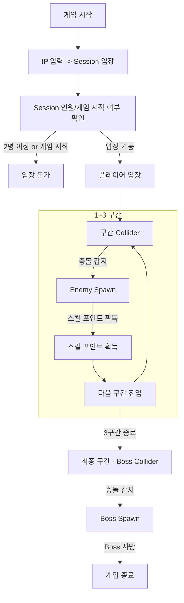
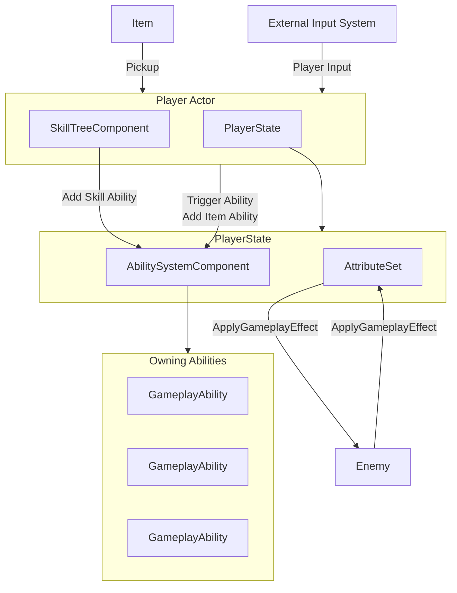

# The LightSeeker

##  프로젝트 개요
- **장르:** 3인칭 슈터 / 액션 RPG  
- **엔진:** Unreal Engine 5.3(Source Build)  
- **플랫폼:** PC  
- **개발 기간:** 2023.09~2024.07
- **개발 인원:** 2인

##  주요 시스템
**GAS 기반의 전투 시스템:**  
- Unreal 제공 GameplayAbilitySystem 플러그인을 이용한 전투 시스템  
- 게임을 진행하며 새로운 Ability를 해금
- 전투 중 적이 드랍하는 유용한 아이템 사용 가능

**Dedicated Server를 이용한 멀티플레이 지원**
- RPC를 이용한 Client-Server 간 상호작용
- 최대 2인 협동 멀티플레이 지원
- 죽은 플레이어에 대한 소생 기능 지원

**AI:**  
- GAS 기반으로 구성 된 일반 4종, 엘리트 1종, 보스 1종의 AI
- Behavior Tree를 이용한 AI 동작 구현

**UI:**  
- HP 표시, 스킬 쿨타임, Damage 표시 Text, 현재 보유 아이템 표시  

## 기술 스택
| 구분 | 내용 |
|------|------|
| 언어 | C++ |
| 엔진 | Unreal Engine 5.3 (Source Build) |
| IDE | Visual Studio 2022 |
| 버전 관리 | Git |

## 프로젝트 구조도
### 게임 흐름

### Player 구조도
